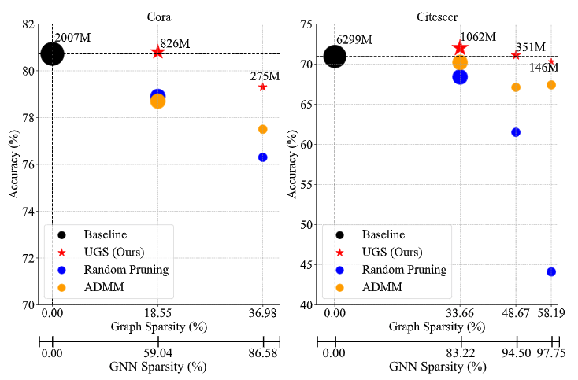
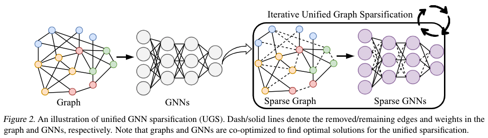

# A Unified Lottery Tickets Hypothesis for Graph Neural Networks

[](https://opensource.org/licenses/MIT)

[Preprint] [A Unified Lottery Tickets Hypothesis for Graph Neural Networks]()

Tianlong Chen\*, Yongduo Sui\*, Xuxi Chen, Aston Zhang, Zhangyang Wang

## Overview

 Summary of our achieved performance (y-axis) at different graph and GNN sparsity levels (x-axis) on Cora and Citeceer node classification. The size of markers represent the inference MACs (= 0.5 FLOPs) of each sparse GCN on the corresponding sparsified graphs. Black circles indicate the baseline, i.e., unpruned dense GNNs on the full graph. Blue circles are random pruning results. Orange circles represent  the performance of a previous graph sparsification approach, i.e., ADMM. Red stars  are established by our method (UGS).

<br/>

## Methodlody



Detials are refer to our [Paper]().


## Implementation

###  Node classification on Cora, Citeseer, PubMed

Refer to [README](./NodeClassification/README.md)

### Link Prediction on Cora, Citeseer, PubMed

Refer to [README](./LinkPrediction/README.md)

### Experiments on OGB Datasets

Refer to Ogbn_ArXiv ([README](./OGBN_arxiv/unify/ogb/ogbn_arxiv/README.md))

Refer to Ogbn_Proteins ([README](./OGBN_proteins/unify/ogb/ogbn_proteins/README.md))

Refer to Ogbn_Collab ([README](./OGBL_Collab/unify/ogb/ogbl_collab/README.md))


## Citation

```
TBD
```


## Acknowledgement

https://github.com/Shen-Lab/SS-GCNs

https://github.com/cmavro/Graph-InfoClust-GIC

https://github.com/lightaime/deep_gcns_torch


